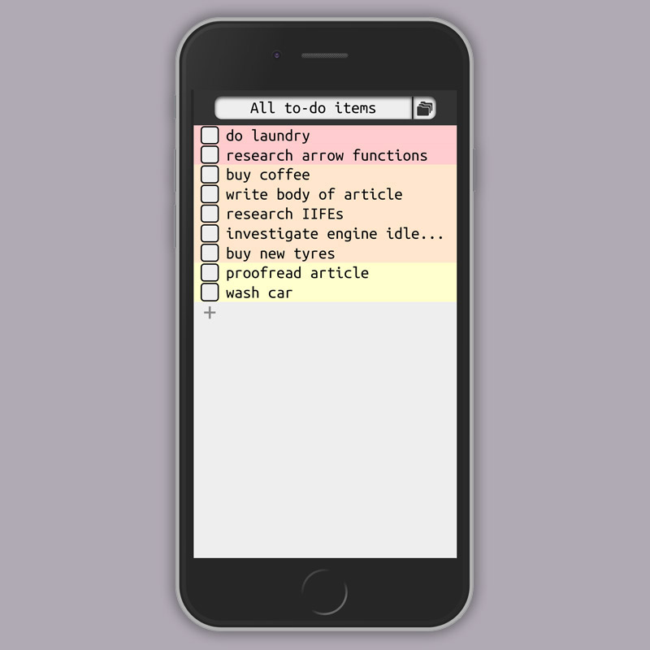
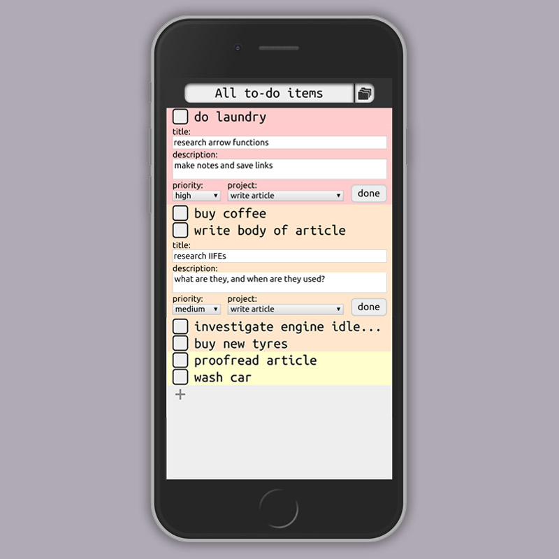
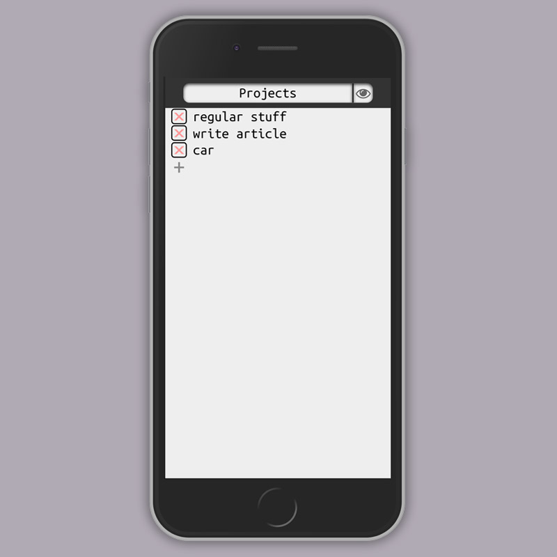
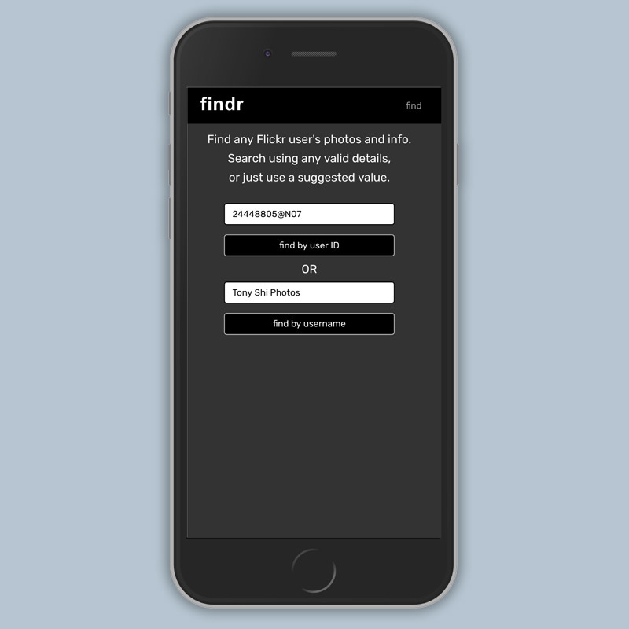
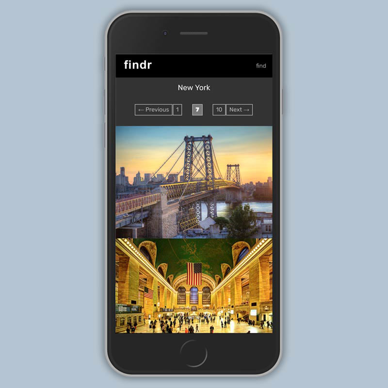
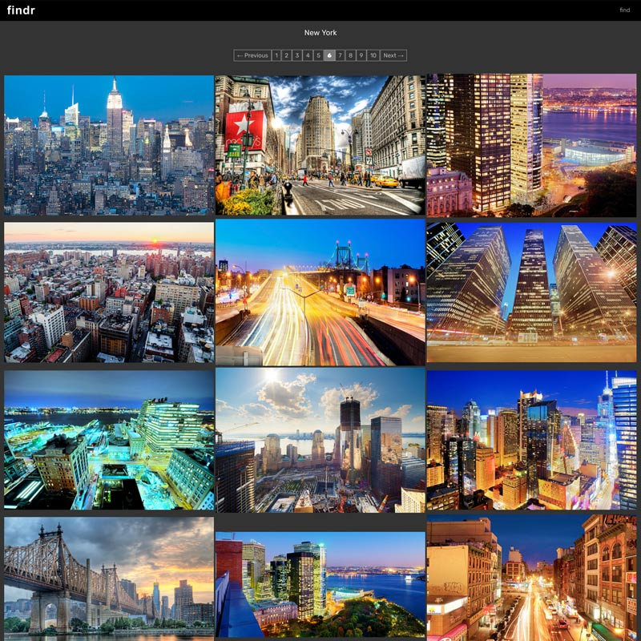

# Portfolio

My profile, portfolio and contact details, @ [simontharby.com](https://simontharby.com).

## Functions of main.js

1. Creates portfolio items DOM and heroku app link event listeners, using data
   from items[...] array.

2. Pings Heroku apps on any mouseover or click if apps not pinged in last 15
   minutes. Shows 'initializing server' view while server(s) start if any
   link to a Heroku app is clicked when servers probably asleep (30+ minutes
   between pings && less than 30 seconds after last pings), and then redirects
   to clicked app link when server up (30 seconds after pings).

3. Stores / restores scroll position.

4. Hides element outlines, except when 'tab' key used (accessibility)

## Portfolio items

The basic DOM of a (non-heroku) portfolio item, created by main js:
```
<div class="d-block d-md-none" style="height:30px;"></div>
<h2 class="d-block d-md-none" style="text-align:center;">To-do</h2>
<div class="row">
  <div class="col-md-4 mb-4">
    <a href="https://to-do.simontharby.com/">
      <!-- start carousel -->
      <div id="to-do" class="carousel slide carousel-fade" data-ride="carousel">
        <ul class="carousel-indicators">
          <li data-target="#to-do" data-slide-to="0" class="active"></li>
          <li data-target="#to-do" data-slide-to="1"></li>
          <li data-target="#to-do" data-slide-to="2"></li>
        </ul>
        <div class="carousel-inner">
          <div class="carousel-item active">
            
          </div>
          <div class="carousel-item">
            
          </div>
          <div class="carousel-item">
            
          </div>
        </div>
      </div>
      <!-- end carousel -->
    </a>
  </div>
  <div class="col-md-8 mb-4">
    <h2 class="d-none d-md-block">To-do</h2>
    <p>A basic to-do app, with a mobile-focused, clean design. Written in pure JavaScript, with an emphasis on separation of app logic from DOM manipulation (using a modular file structure, bundled with Webpack). View to-do items by project, or view all to-do items from all projects. Click / tap a to-do item to view / edit details. To-do items are ordered firstly by priority, and secondly by date of creation.</p>
    <div class="d-none d-md-block" style="height:15px;"></div>
    <div class="row">
      <div class="col-md-6 mb-2">
        <a href="https://to-do.simontharby.com/">
          
        </a>
      </div>
      <div class="col-md-6 mb-2">
        <a href="https://github.com/jinjagit/todo">
          
        </a>
      </div>
    </div>
  </div>
</div>
```

Contrast with the DOM for a heroku portfolio item. Note the `javascript:;` hyperlinks and extra class tags:
```
<div class="d-block d-md-none" style="height:30px;"></div>
<h2 class="d-block d-md-none" style="text-align:center;">Findr</h2>
<div class="row">
  <div class="col-md-4 mb-4">
    <a href="javascript:;">
      <!-- start carousel -->
      <div id="findr" class="Findr heroku carousel slide carousel-fade" data-ride="carousel">
        <ul class="carousel-indicators">
          <li data-target="#findr" data-slide-to="0" class="active"></li>
          <li data-target="#findr" data-slide-to="1"></li>
          <li data-target="#findr" data-slide-to="2"></li>
        </ul>
        <div class="carousel-inner">
          <div class="carousel-item active">
            
          </div>
          <div class="carousel-item">
            
          </div>
          <div class="carousel-item">
            
          </div>
        </div>
      </div>
      <!-- end carousel -->
    </a>
  </div>
  <div class="col-md-8 mb-4">
    <h2 class="d-none d-md-block">Findr</h2>
    <p>Interact with the Flickr-API via a Rails application. Search for user by user ID or username. Display user information and photos. Browse all photos or by album. Includes error handling of Flickr-API errors (on form submission). Includes suite of Rspec tests, using VCR gem for all tests which involve an expected response from the Flickr API. Mobile / desktop repsonsive layout.</p>
    <div class="d-none d-md-block" style="height:15px;"></div>
    <div class="row">
      <div class="col-md-6 mb-2">
        <a href="javascript:;">
          
        </a>
      </div>
      <div class="col-md-6 mb-2">
        <a href="https://github.com/jinjagit/flickr-api">
          
        </a>
      </div>
    </div>
  </div>
</div>
```

## Images

Each portfolio item needs 3 jpeg images, 800x800px, progressive, named; <tag>#.jpg, (# == 1, 2, & 3)
